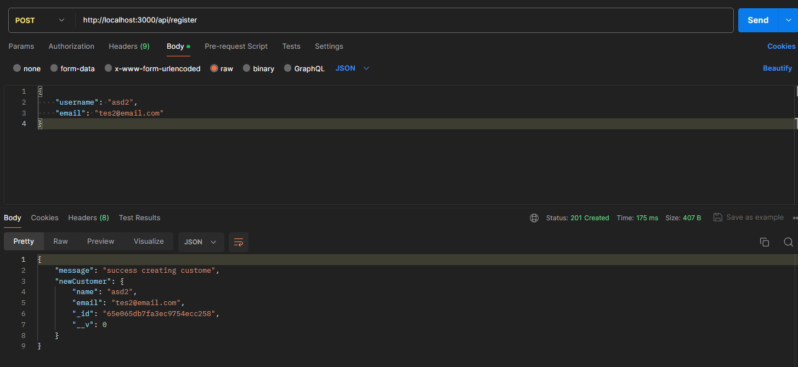
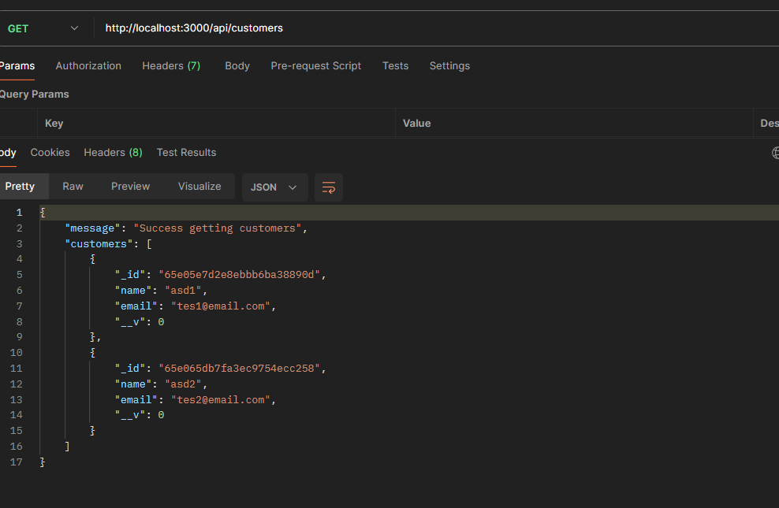
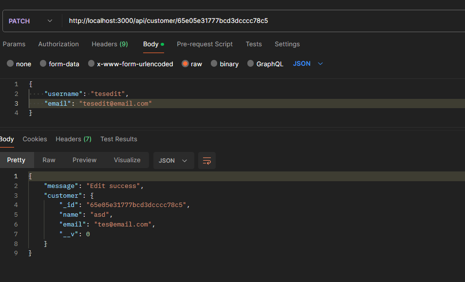
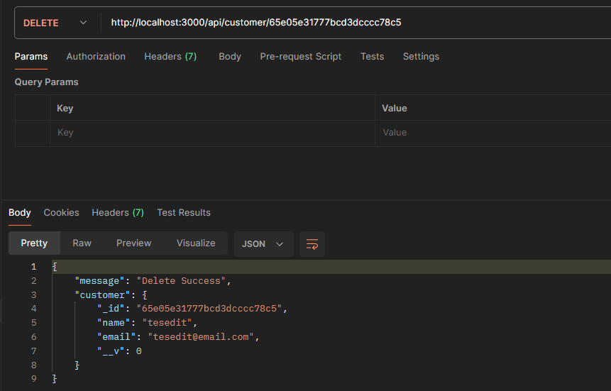

# CRUD-Customer-BE

Task from E-gogo

### Technology Used:


#### Guide:

1. Git clone this repository.
2. Open the project and start with `npm install`, this will install all dependencies.
3. Create your own `.env` file (this will contain sensitive data or variables for your project.)
   - Below is the example:

```env
MONGODB_URI=your_mongodb_uri
```

4. Run `npm start` to start the project, you will get a notification like this `Server listening on port 3000` & `Successfully connect to MongoDb`
5. Now you have successfully run the project.

#### API Document Screenshots:




